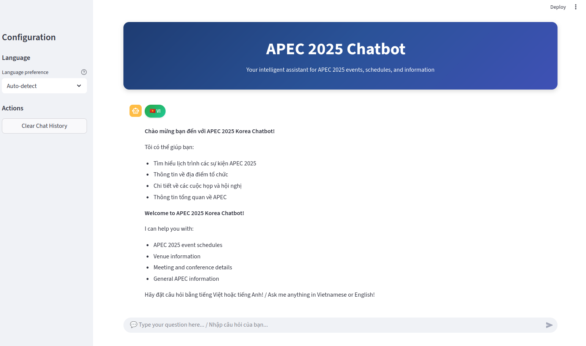
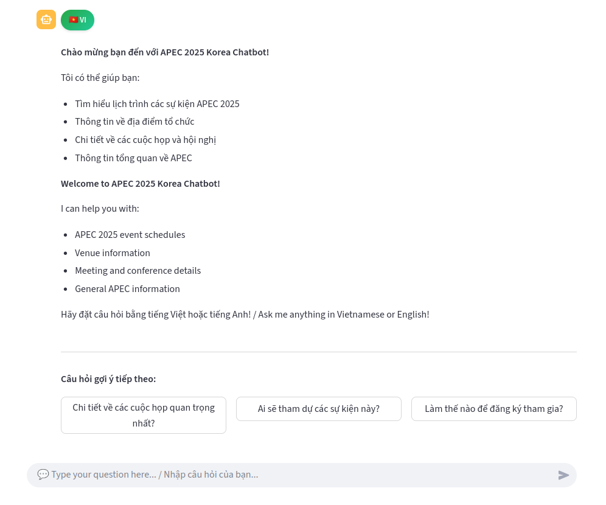
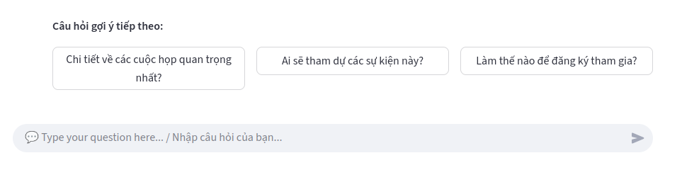

# APEC 2025 Korea RAG Chatbot

## Pipeline

```
Web Scraping → Data  → Processing →Chunking → Embeddings → ChromaDB → Backend → Frontend
```






### Components:
- **Backend**: FastAPI with multilingual RAG processing
- **Frontend**: Streamlit web interface
- **Models**: E5 multilingual embeddings + Gemini LLM
- **Database**: ChromaDB vector store
- **Languages**: Vietnamese and English support(Could add more since we are essentially using an embedding model trained on multiple languages, just need to change the LLM to support replying that language)

## Project Structure

```
├── README.md                    # Project documentation
├── requirements_api.txt         # Dependencies
├── start_api.py                # Main API startup script (root)
├── start_frontend.py           # Main frontend startup script (root)
├── Notebook files(for data scraping, processing and embedding)/
│   ├── RAG_LLM_Integration.ipynb    # Model integration
│   ├── RAG_Prep.ipynb              # Data preparation
│   ├── RAG_Test_Embedding.ipynb    # Embedding testing
│   └── Scraper.ipynb              # Web scraping
├── backend/                    # Backend directory
│   ├── .env                   # Environment variables
│   ├── modules/               # Core modules
│   │   ├── chatbot_core.py   # RAG logic and model handling
│   │   ├── config.py         # Configuration and styling
│   │   ├── ui_components.py  # Streamlit UI components
│   │   └── utils.py          # Utility functions
│   ├── api_backend/          # API backend 
│   │   ├── api_backend.py    
│   │   └── start_api_backend.py # Backend startup script
│   └── chroma_db_langchain_e5/ # Vector database storage
├── data/processed/            # Processed documents and embeddings
├── demo/                      # Demo startup scripts
│   └── start_frontend.py     # Demo frontend startup
└── direct loading/           # Original direct loading version
    ├── app.py               # Direct model loading app
    └── run_app.py           # Direct loading startup
```


## Usage Instructions
Step 1 - 3 are all optional as I already have created the chromadb. Just add api key (gemini) and run backend+frontend

### Step 1: Data Collection with Scraper(OPtional)
Use the `Scraper.ipynb` notebook to collect data from web sources:

1. Open `Notebook files(for data scraping, processing and embedding)/Scraper.ipynb`
2. Configure target urls for APEC 2025 content
3. Run all cells to scrape and save raw data

### Step 2: Data Processing with RAG_Prep(Optional)
Use the `RAG_Prep.ipynb` notebook to process and prepare your data:

1. Open `Notebook files(for data scraping, processing and embedding)/RAG_Prep.ipynb`
2. Load raw scraped data
3. Clean and preprocess text content
4. Chunk documents into optimal sizes
5. Add metadata and structure
6. Output: Processed documents in `data/processed/`


### Step 3: Create ChromaDB with RAG_LLM_Integration(OPTIONAL)
Use the `RAG_LLM_Integration.ipynb` notebook to create embeddings and vector database:

1. Open `Notebook files(for data scraping, processing and embedding)/RAG_LLM_Integration.ipynb`
2. Load processed documents from Step 2
3. Generate embeddings using E5 multilingual model
4. Create ChromaDB vector store
5. Test retrieval functionality
6. Output: ChromaDB database in `backend/chroma_db_langchain_e5/`


### Step 4: Configure Environment and API(REQUIRED)
Set up the backend configuration:

1. Create `.env` file in `backend/` directory:
```bash
GOOGLE_API_KEY=your_google_api_key_here
```

2. Install dependencies:
```bash
pip install -r requirements_api.txt
```

3. Configure settings in `backend/modules/config.py`:
   - Model parameters
   - Database paths

### Step 5: Start the Backend API(REQUIRED)
Launch the FastAPI backend service:

```bash
python backend/api_backend/start_api_backend.py
```

- API will be available at: `http://localhost:8000`

### Step 6: Start the Frontend Interface(REQUIRED)
Launch the Streamlit frontend:

```bash
python demo/start_frontend.py
```

### Step 7: Test the Complete System
1. Open the frontend at `http://localhost:8502`
2. Select language (Vietnamese/English or auto-detect)
3. Ask questions 

## API Endpoints

### `POST /chat`
Main RAG endpoint for chat responses.

**Request**:
```json
{
  "message": "What are the main APEC 2025 events?",
  "auto_detect": true,
  "preferred_language": "vi",
  "top_k": 5
}
```

**Response**:
```json
{
  "answer": "APEC 2025 sẽ có các sự kiện chính...",
  "sources": [
    {
      "title": "APEC 2025 Schedule",
      "url": "https://...",
      "contains_table": false,
      "chunk_length": 850,
      "content_preview": "..."
    }
  ],
  "num_sources": 3,
  "detected_language": "vi",
  "response_time": 1.23
}
```

### `POST /suggestions`
Follow-up suggestions.

**Request**:
```json
{
  "response_content": "APEC 2025 events include...",
  "language": "en"
}
```

**Response**:
```json
{
  "suggestions": [
    "What are the most important meetings?",
    "Who will attend these events?",
    "How to register for participation?"
  ]
}
```

### Other Endpoints
- `GET /` - Health check
- `GET /health` - Detailed system status
- `GET /languages` - Supported languages

## Frontend 

### Streamlit Interface (`./demo/start_frontend.py `)
- Uses components from `modules/ui_components.py`

## Backend

### Utils (`modules/utils.py`)
- Contains utility functions for language detection, suggestion generation, etc.
#### Autosuggestion
- **Hardcoded suggestions**: Pre-defined questions for common topics
- **LLM-Generated suggestions**: Gemini generates context-aware questions
- **Combination**: Hardcoded + LLM-generated suggestions(up to 3, but you can change the columns to display more and change the number of suggestions in the `get_context_suggestions` function in `modules/utils.py`)

### Chatbot Core (`modules/chatbot_core.py`)
- Handles RAG processing, model setup, and query execution

##### Multilingual Prompts
- **Vietnamese**: OPtimized prompt for Vietnamese responses
- **English**: Optimized prompt for English responses

##### Retrieval Process
1. **Query Processing**: Language detection + task prefix
2. **Vector Search**: Similarity search in ChromaDB
3. **Context Assembly**: Top-k relevant documents
4. **LLM Generation**: Gemini 2.0 Flash with prompts


### Config (`modules/config.py`)
- Contains configuration and constants

### UI Components (`modules/ui_components.py`)
- Handles rendering of chat interface, suggestions, etc.