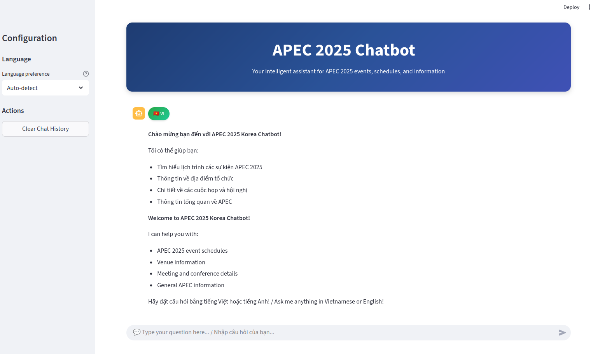
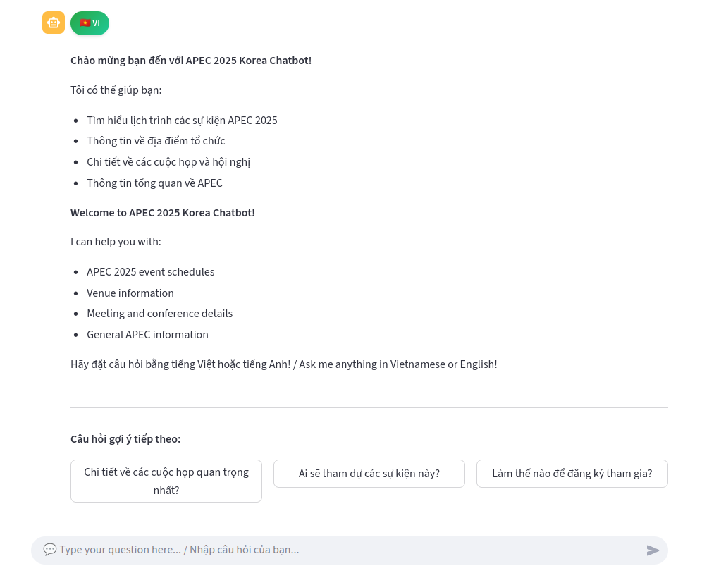
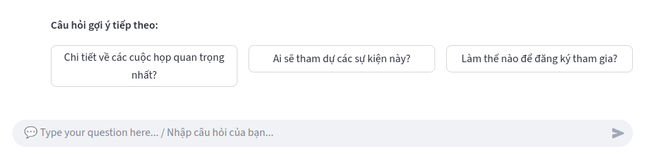

# APEC 2025 Korea RAG Chatbot

## Pipeline

```
Web Scraping → Data  → Processing →Chunking → Embeddings → ChromaDB → Backend → Frontend
```






### Components:
- **Backend**: FastAPI with multilingual RAG processing
- **Frontend**: Streamlit web interface
- **Models**: E5 multilingual embeddings + Gemini LLM
- **Database**: ChromaDB vector store
- **Languages**: Vietnamese and English support(Could add more since we are essentially using an embedding model trained on multiple languages, just need to change the LLM to support replying that language)

## Project Structure

```
├── README.md                    # Project documentation
├── requirements_api.txt         # Dependencies
├── start_api.py                # Main API startup script (root)
├── start_frontend.py           # Main frontend startup script (root)
├── Notebook files(for data scraping, processing and embedding)/
│   ├── RAG_LLM_Integration.ipynb    # Model integration
│   ├── RAG_Prep.ipynb              # Data preparation
│   ├── RAG_Test_Embedding.ipynb    # Embedding testing
│   └── Scraper.ipynb              # Web scraping
├── backend/                    # Backend directory
│   ├── .env                   # Environment variables
│   ├── modules/               # Core modules
│   │   ├── chatbot_core.py   # RAG logic and model handling
│   │   ├── config.py         # Configuration and styling
│   │   ├── ui_components.py  # Streamlit UI components
│   │   └── utils.py          # Utility functions
│   ├── api_backend/          # API backend 
│   │   ├── api_backend.py    
│   │   └── start_api_backend.py # Backend startup script
│   └── chroma_db_langchain_e5/ # Vector database storage
├── data/processed/            # Processed documents and embeddings
├── demo/                      # Demo startup scripts
│   └── start_frontend.py     # Demo frontend startup
└── direct loading/           # Original direct loading version
    ├── app.py               # Direct model loading app
    └── run_app.py           # Direct loading startup
```


### Config (`modules/config.py`)
- Contains configuration and constants

### UI Components (`modules/ui_components.py`)
- Handles rendering of chat interface, suggestions, etc.
